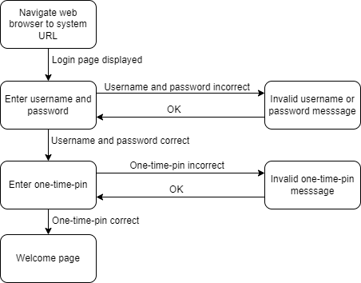
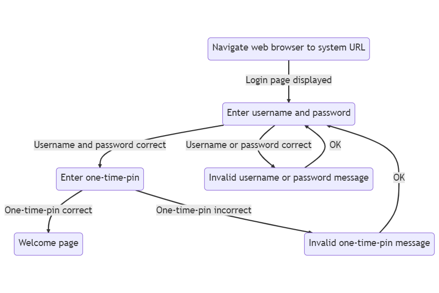

## Appendix

### Embed Draw.io Diagram

Draw.io can save drawings as a *.drawio.png file. So it is a png file, but the details required by Draw.io to edit the image is embedded in the png file.

### Embed Mermaid Diagram

Mermaid is similar to PlantUML in that it is a diagram as code tool.
To embed these types of images in Structurizr documentation, 2 files are required:
- The Mermaid diagram code file.
- A png file export of the diagram.
Please note that if the diagram code is changed, the png file is not automatically exported or updated.

